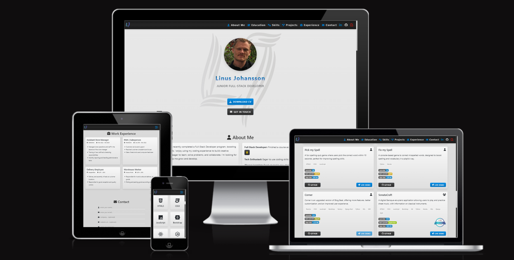

# j0hanz Portfolio




[](https://www.linkedin.com/in/linus-johansson-software-dev/)[](https://github.com/j0hanz)[](https://linus-johansson-cv-d308be9b73e1.herokuapp.com/)

---

**Welcome to my portfolio website! This site showcases my projects, skills, and professional background. It features a modern, responsive design and highlights my work in web development. Explore my projects, learn about my skills, and get in touch through the contact form.**

## 🚀 Features

- **Responsive Design**: Optimized for all devices, from desktop to mobile.
- **Project Showcase**: Integrates with GitHub to display my work.
- **Contact Form**: Get in touch with me directly.
- **Credential Modal**: View my certification.

---

## 💡 Example Usage

To use the contact form, simply fill out the fields and click "Submit". The form will send an email using EmailJS.

To view the project showcase, navigate to the "Projects" section. Each project card links to the corresponding GitHub repository.

---

## 🎨 Design

### 🖋️ Typography & Colors

- **Fonts**: Sleek **Poppins** font for readability.
- **Scrollbars**: Soft gray gradients for modern styling.
- **Buttons & Hover**: Vibrant gradients for a dynamic feel.
- **Backgrounds**: Minimal gray gradients to keep the focus on content.

### 🏅 Credential Handling

- **Borderless**: Clean, no-border design for a polished look.

### 📄 Download CV Modal

- **Interactive Flags**: Provided by [flag-icons](https://github.com/lipis/flag-icons) for easy CV downloads.

### 📬 Contact Form

- **Input Group**: Icons integrated into input fields for a modern look.
- **Validation**: Real-time feedback for quick error handling.
- **Custom Inputs**: Sleek and minimalistic for a clean interface.

---

## 🛠️ Technologies Used

- **[React](https://reactjs.org/)**: A JavaScript library for building user interfaces.
- **[Bootstrap](https://getbootstrap.com/)**: A CSS framework for developing responsive and mobile-first websites.
- **[FontAwesome](https://fontawesome.com/)**: A toolkit for icons and social logos.
- **[Heroku](https://www.heroku.com/)**: A cloud platform for deploying and managing applications.
- **[EmailJS](https://www.emailjs.com/)**: A service to send emails directly from JavaScript.
- **[React Toastify](https://fkhadra.github.io/react-toastify/)**: A library for toast notifications in React.

---

## 🧑‍💻 Setup Instructions

[](https://gitpod.io/#https://github.com/j0hanz/portfolio)

1. **Clone the repository:**

   ```bash
   git clone https://github.com/j0hanz/portfolio
   ```

   ```bash
   cd portfolio
   ```

2. **Install dependencies:**

   ```bash
   npm install
   ```

3. **Set up environment variables:**
   Create a **.env** file in the root directory and add the following variables:

   ```bash
   REACT_APP_SERVICE_ID=your_service_id
   REACT_APP_TEMPLATE_ID=your_template_id
   REACT_APP_USER_ID=your_user_id
   REACT_APP_GITHUB_TOKEN=your_github_token
   ```

4. **Start the development server:**

   ```bash
   npm start
   ```

---

## 📂 Components Overview

This portfolio website is composed of several key sections, each designed to showcase different aspects of my professional background and skills. Below is an overview of each section:

### About Me

The **About Me** section provides a brief introduction to who I am, my interests, and my professional goals. It includes a list of key attributes and a detailed description of my background.

### Education

The **Education** section showcases my academic achievements and professional training.

### Skills

The **Skills** section showcases my technical skills, represented with icons and labels.

### Portfolio

The **Portfolio** section features a collection of my projects, providing details about each project, including descriptions, technologies used, and links to GitHub repositories and live demos.

### Work Experience

The **Work Experience** section highlights my professional journey, detailing the roles I've held, the companies I've worked for, and my responsibilities in each position.

### Contact

The **Contact** section includes a form that allows visitors to get in touch with me directly. The form includes fields for name, email, company, website URL, and message. It also includes validation to ensure the information provided is accurate.

### 🔄 Reusable Components

- **Spinner**: A reusable loading spinner component used across various sections to indicate loading states.
- **OutsideClickHandler**: A custom hook for handling outside clicks, enhancing user interactions.
- **ModalCv**: A modal component for downloading CVs in different languages.
- **Toast**: A component to manage toast notifications using `react-toastify`.
- **Badge**: A component to display badges with links and images.

---

## 🙏 Credits

Acknowledgments for the tools and resources used in building this portfolio:

- **[React Toastify](https://fkhadra.github.io/react-toastify/)**: For toast notifications.
- **[EmailJS](https://www.emailjs.com/)**: For handling email submissions.
- **[Logo](https://logo.com/)**: Created with Logo.com.
- **[FontAwesome](https://fontawesome.com/)**: Powered by FontAwesome for icons.
- **[GitHub API](https://docs.github.com/en/rest)**: Used for displaying project data.
- **[React Bootstrap](https://react-bootstrap.netlify.app/)**: Ensures responsive design.
- **[Flag-icons](https://github.com/lipis/flag-icons)**: Provides interactive flags.
